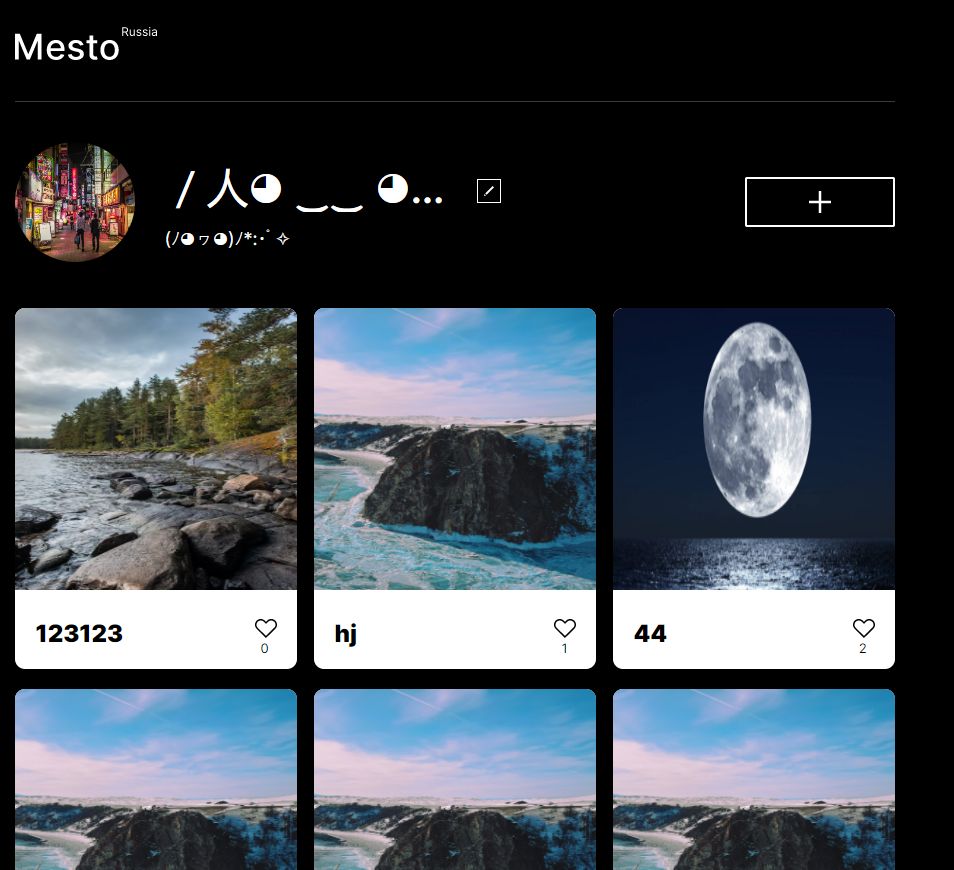
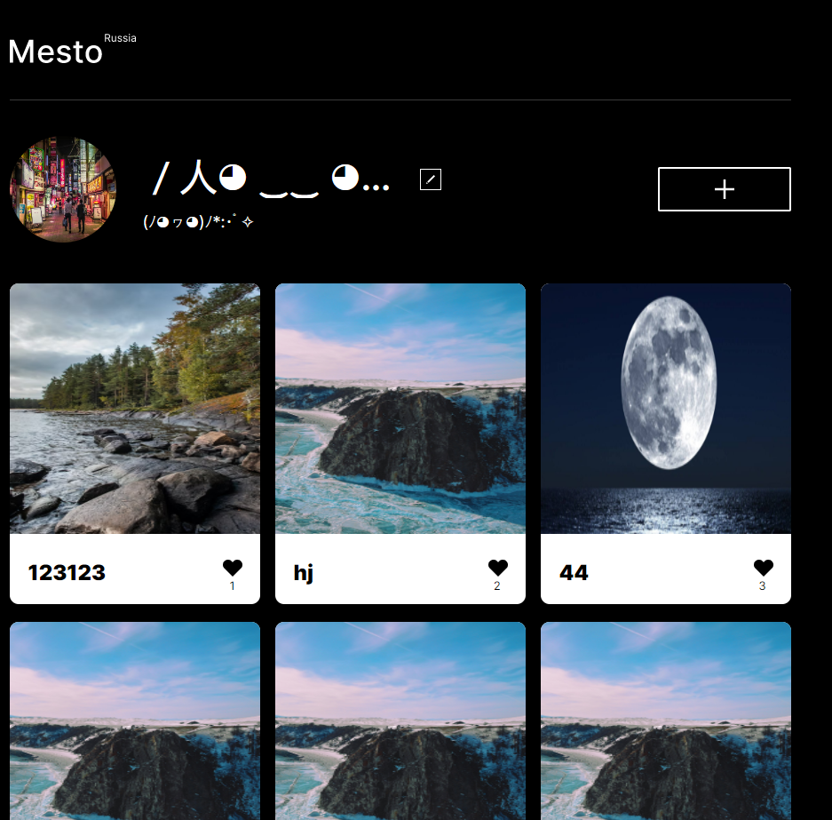
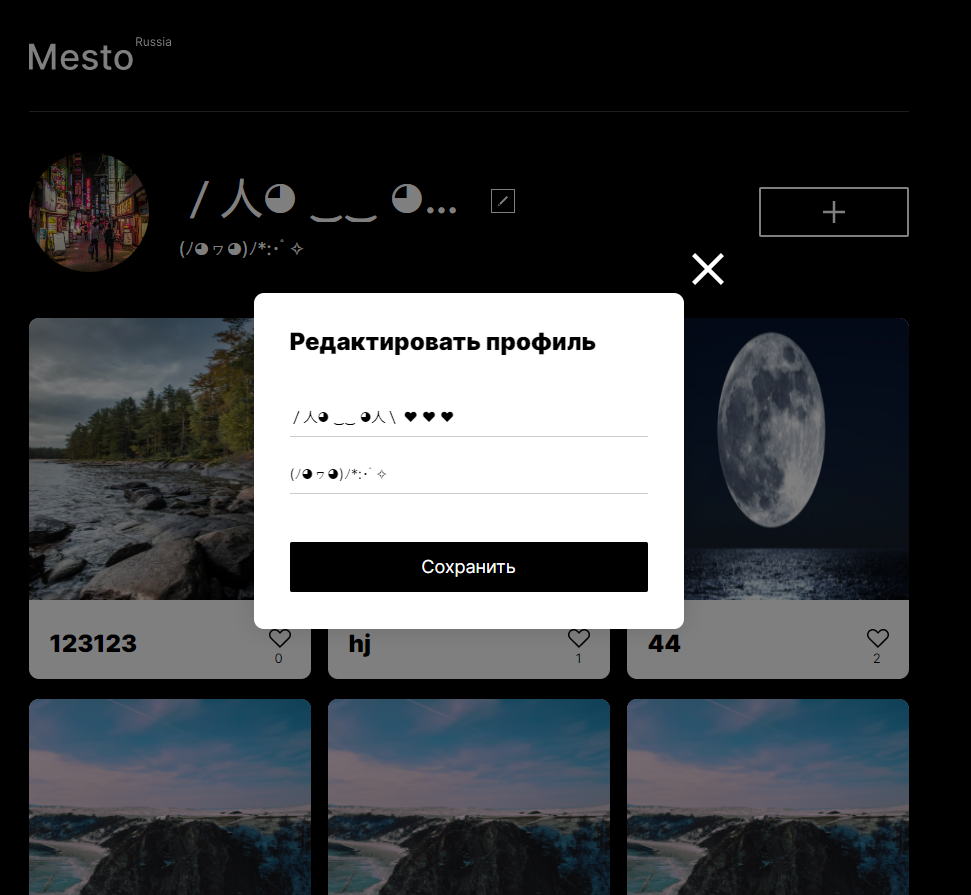
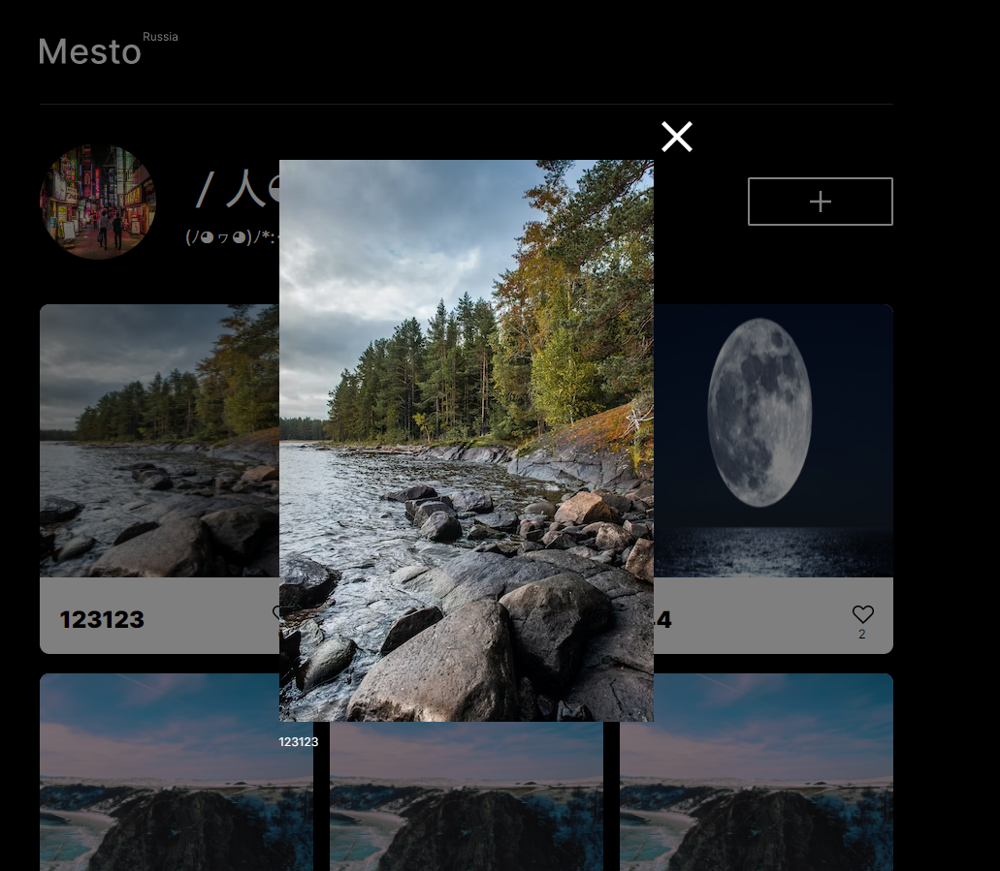
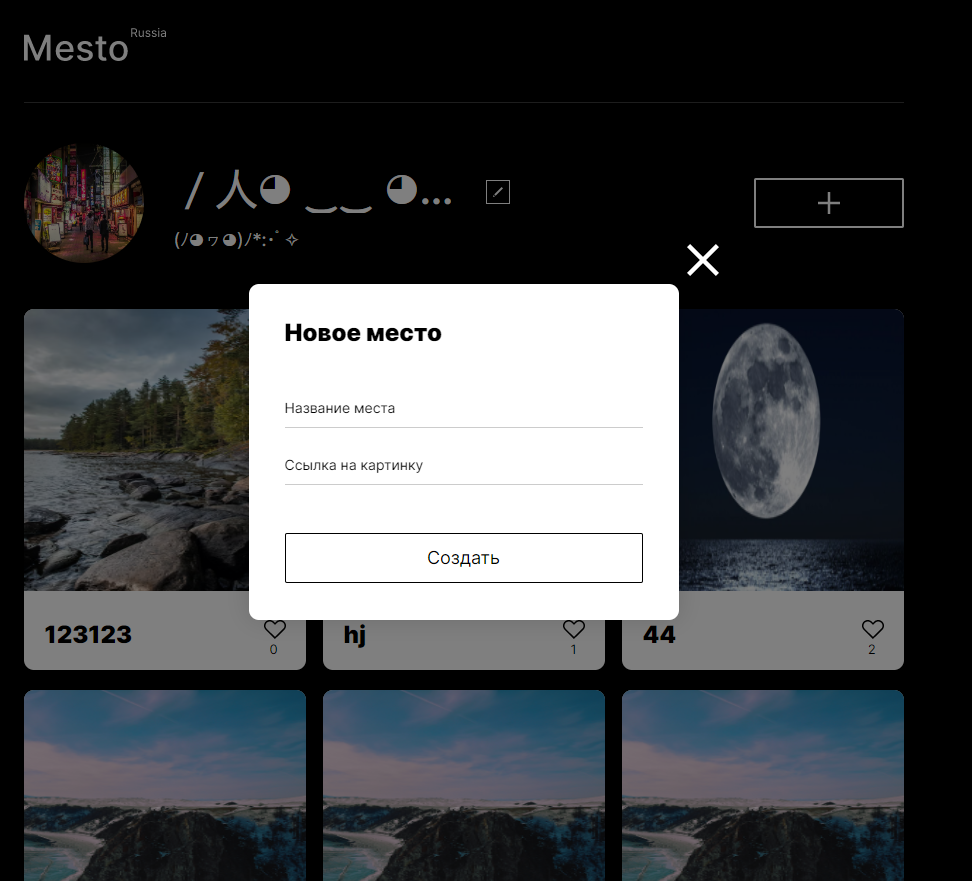

# Проектная работа "Место"

"Место" - одностраничная социальная сеть, где пользователи могут выставлять свои фотокарточки и обмениваться лайками.

Основная страница
Здесь можно редактировать аватарку, информацию о себе, создать и удалить карточку или поставить лайк. При клике по карточке откроется окно, где фото будет приближено

Основная страница с лайками

Редактирование информации о себе

Окно с карточкой

Окно создания карточки
